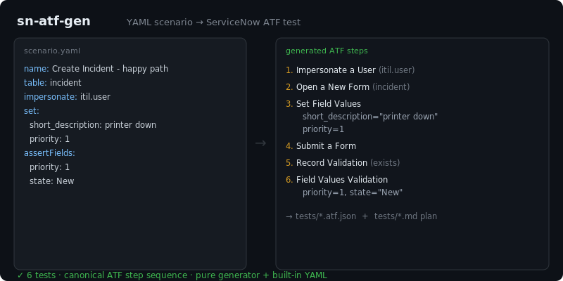

# sn-atf-gen

[](https://github.com/JCreatesGH/sn-atf-gen/actions)
[](https://www.typescriptlang.org/)
[](LICENSE)

Generate ServiceNow **Automated Test Framework** (ATF) tests from a short YAML scenario — no more hand-clicking the same Open Form → Set Fields → Submit → Validate steps for every table.



## Use it

```ts
import { generate, buildSteps } from "sn-atf-gen";

const files = generate({
  name: "Create Incident - happy path",
  table: "incident",
  impersonate: "itil.user",
  set: { short_description: "printer down", priority: 1 },
  assertFields: { priority: 1, state: "New" },
});
// files["tests/create-incident-happy-path.atf.json"]  -> ATF test definition
// files["tests/create-incident-happy-path.md"]         -> human-readable plan
```

## What it generates

The canonical ATF step sequence, in order, only emitting the steps your scenario needs:

1. **Impersonate a User** (if `impersonate` set)
2. **Open a New Form** (`table`)
3. **Set Field Values** (from `set`)
4. **Submit a Form**
5. **Record Validation** — a record matching the entered values exists
6. **Field Values Validation** (from `assertFields`)

Output is a JSON test definition plus a Markdown test plan for review. `generate(spec)` is a **pure function**, so every branch is unit-tested, and a tiny built-in YAML parser keeps it dependency-free.

## Development

```bash
npm install && npm test    # 6 tests
npm run build              # tsc, clean
```

## License

MIT
